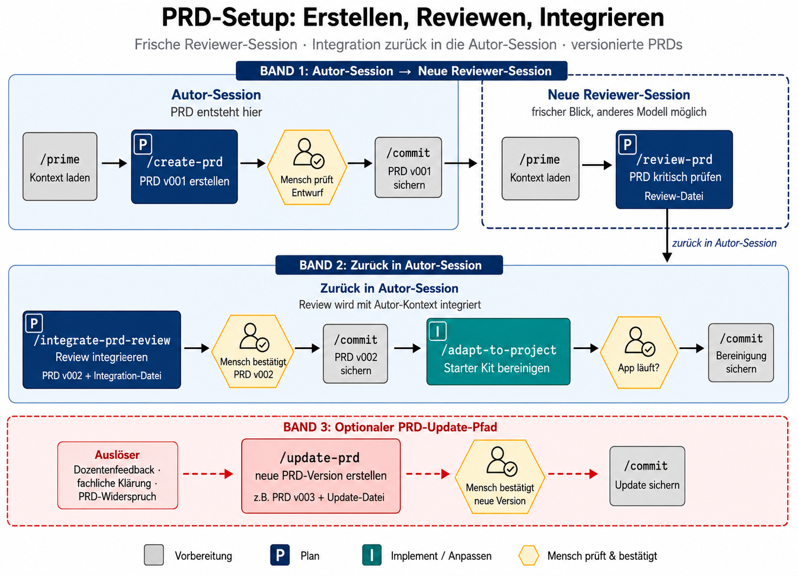

# PIV-Workflow – Mit Agent Skills Features bauen

Diese Anleitung zeigt dir, wie du mit AI-Agenten strukturiert neue Features im Starter Kit planst, umsetzt und validierst.

## 1. Was ist der PIV-Ansatz?

PIV steht für Plan → Implement → Validate. Du lässt den Agenten nicht direkt Code schreiben, sondern zuerst einen konkreten Plan erstellen, den du prüfst und bestätigst. Danach setzt der Agent den Plan Task für Task um. Validierung bedeutet nicht nur "die App startet", sondern auch Tests, manuelle Prüfung, Rollenverhalten und dokumentierte Akzeptanzkriterien.

Inspiration für diesen Workflow waren unter anderem diese Videos:

- [The True Power of AI Coding - Build Your OWN Workflows (Full Guide)](https://www.youtube.com/watch?v=mHBk8Z7Exag)
- [The 5 Techniques Separating Top Agentic Engineers Right Now](https://www.youtube.com/watch?v=ttdWPDmBN_4)

## 2. Die Skills im Überblick

Im CAS Prozessdigitalisierung gibt es typischerweise zuerst eine Gesamtarchitektur als Markdown-Datei. Diese Gesamtarchitektur beschreibt den End-to-End-Prozess und alle beteiligten IT-Systeme oder Komponenten. Dieses Starter Kit wird danach für genau ein solches IT-System oder eine Komponente verwendet. Das PRD in diesem Repo beschreibt deshalb nicht den ganzen Prozess, sondern das konkrete IT-System, das neu gebaut oder als Mock eines bestehenden Systems umgesetzt wird.

Die Gesamtarchitektur ist für `create-prd` hilfreich, aber nicht verpflichtend. Wenn ihr eine Gesamtarchitektur verwendet, gebt neben dem Markdown-Dokument immer auch die zugehörige `architecture.dsl` mit, falls sie existiert. Die DSL-Datei ist die maschinenlesbare Quelle für Architekturdiagramm-Informationen; SVG- oder PNG-Exporte werden nicht inhaltlich analysiert.

Datenschutz: Gesamtarchitekturen können Unternehmensnamen, interne Systeme, Personenrollen oder vertrauliche Prozessdetails enthalten. Anonymisiert die Unterlagen vor dem Einfügen oder Hochladen, wenn daraus ein reales Unternehmen, reale Personen oder sensible Informationen erkennbar sind.

Wenn mehrere Personen im selben Repository an einem gemeinsamen IT-System arbeiten, gilt weiterhin dieser PIV-Ablauf. Beachtet zusätzlich die Koordinationsregeln in [`COLLABORATION.md`](COLLABORATION.md), insbesondere zu gemeinsamem PRD, Feature-Aufteilung, `TASKS.md`, Branches und `prisma/schema.prisma`.

| Skill | Wann nutzen? | Typische Eingabe |
|---|---|---|
| `prime` | Zu Beginn einer Session, um Projektkontext zu laden | `/prime` |
| `create-prd` | Am Anfang eines Starter-Kit-Projekts, um das konkrete IT-System, seine Ausbaustufen und dessen MVP-Scope zu beschreiben | `/create-prd docs/project/prds/antragssystem.md` plus Gesamtarchitektur-Markdown und `architecture.dsl`, falls vorhanden. Der Skill speichert das initiale PRD als `v001`, z.B. `antragssystem-v001.md`. |
| `review-prd` | In einer frischen Reviewer-Session nach `/prime`, idealerweise mit anderem Modell: prüft das PRD kritisch und schreibt eine Review-Datei, ohne das PRD zu ändern | `/review-prd docs/project/prds/antragssystem-v001.md` |
| `integrate-prd-review` | Zurück in der Autor-Session: bewertet Review-Vorschläge, holt Entscheidungen ein, erstellt die nächste PRD-Version und schreibt eine Integration-Datei | `/integrate-prd-review docs/project/prds/antragssystem-v001.md docs/project/prd-reviews/antragssystem-v001-r01-review.md` |
| `update-prd` | Bei fachlichen Änderungen, Dozentenfeedback oder beim Planen erkannten PRD-Widersprüchen: erstellt eine neue PRD-Version und dokumentiert die Änderung | `/update-prd docs/project/prds/antragssystem-v002.md` |
| `adapt-to-project` | Einmalig nach PRD-Review, Review-Integration und fachlicher PRD-Bestätigung, vor dem ersten `plan-feature`: bereinigt Demo-Code auf Basis des PRDs und validiert den Build | `/adapt-to-project docs/project/prds/antragssystem-v002.md` |
| `plan-feature` | Für ein einzelnes Feature aus dem PRD, bevor Code geschrieben wird: erstellt den initialen Plan `plan-v001.md` | `/plan-feature "PRD Kapitel Antrag einreichen"` |
| `review-feature-plan` | In einer frischen Reviewer-Session nach `/prime`: prüft Architektur, Tasks, Reihenfolge und Validierung des Feature-Plans | `/review-feature-plan docs/project/features/antrag-formular/plan-v001.md` |
| `integrate-feature-plan-review` | Zurück in der Autor-Session: bewertet Plan-Review-Vorschläge, erstellt die nächste Plan-Version und schreibt eine Integration-Datei | `/integrate-feature-plan-review docs/project/features/antrag-formular/plan-v001.md docs/project/features/antrag-formular/plan-reviews/plan-v001-r01-review.md` |
| `update-feature-plan` | Bei PRD-Updates, Planfehlern, Execute-Befunden oder technischen Klärungen: erstellt eine neue Plan-Version und dokumentiert die Änderung | `/update-feature-plan docs/project/features/antrag-formular/plan-v002.md` |
| `execute` | Wenn eine reviewte und bestätigte Feature-Plan-Version vorliegt | `/execute docs/project/features/antrag-formular/plan-v002.md` |
| `document` | Nach Umsetzung und Validierung, um Feature-Dokumentation zu erstellen | `/document docs/project/features/antrag-formular/plan-v002.md` |
| `reflect-rules` | Nach `/document` bei Verdacht auf wiederholbare Agent-Fehler, Nacharbeiten, Planlücken oder wiederholte Nutzerkorrekturen | `/reflect-rules docs/project/features/antrag-formular/plan-v002.md` |
| `commit` | Nach initialem PRD-Entwurf `v001`, nach `/review-prd`, nach Review-Integration oder Update einer neuen PRD-Version, nach erfolgreicher Starter-Kit-Bereinigung, nach initialem Feature-Plan `plan-v001`, nach `/review-feature-plan`, nach Review-Integration oder Update einer neuen Plan-Version, nach validiertem Task, kohärenter Phase oder finalem Feature-Abschluss | `/commit` |
| `create-rules` | Wenn Projekt-Instructions aktualisiert werden sollen | `/create-rules` |
| `init-project` | Bei einem frisch geklonten Starter-Kit-Projekt | `/init-project` |


*PRD-Erstellung, Review, Integration und Starter-Kit-Anpassung. Erstellt mit OpenAI gpt-image-2, Thinking Mode (ChatGPT GPT-5.5).*


*Feature-Zyklus mit Planung, Plan-Review, Integration, Umsetzung und Validierung. Erstellt mit OpenAI gpt-image-2, Thinking Mode (ChatGPT GPT-5.5).*

## 3. Wie starte ich einen Skill in meinem Tool?

| Tool | Wie Skill aufrufen |
|---|---|
| Kilo Code | Einmal `npm run setup:skills` ausführen, dann `/prime`, `/create-prd`, `/plan-feature`, `/execute` usw. im Chat verwenden. |
| Codex Extension in VS Code | Einmal `npm run setup:skills` ausführen, dann Skills per Slash Command im Chat verwenden. |
| Claude Extension in VS Code | Einmal `npm run setup:skills` ausführen, dann Skills per Slash Command im Chat verwenden. |
| Antigravity | Einmal `npm run setup:skills` ausführen, dann Skills per Slash Command im Agent-Panel verwenden. |

## 4. Typischer Ablauf für ein IT-System

Beispiel: Eure Gesamtarchitektur beschreibt einen Antragsprozess mit mehreren beteiligten IT-Systemen. In diesem Starter-Kit-Projekt baust oder mockst du eines dieser Systeme, zum Beispiel ein Antragssystem. Dafür erstellst du zuerst ein PRD für genau dieses IT-System. Danach planst und implementierst du einzelne Features aus diesem PRD Schritt für Schritt.

Falls keine Gesamtarchitektur vorhanden ist, funktioniert `create-prd` trotzdem. Der Skill fragt dann Rollen, Umsysteme, Schnittstellen, Scope und Ausbaustufen direkt im Dialog ab.

Im CAS-Kontext ist das Starter-Kit-Projekt Brownfield: Der technische Stack ist bereits durch das Starter Kit und die Projektregeln vorgegeben. Das PRD soll deshalb keine neuen Stack-Entscheide erfinden, sondern auf vorhandene Vorgaben wie `AGENTS.md`, `KILO_INSTRUCTIONS.md`, `package.json`, Prisma-Schema und bestehende Starter-Kit-Konventionen referenzieren. Wenn euer konkretes System keine Benutzeroberfläche, keine E-Mail-Funktion oder andere vorhandene Starter-Kit-Bausteine benötigt, ist das im Prototyp akzeptabel. Solche Bausteine müssen nicht gelöscht werden, solange sie nicht stören.

Wichtig: Der Feature-Zyklus wird mehrfach durchlaufen. Für jedes neue Feature startest du bewusst eine neue Agent- oder Chat-Session, lädst mit `/prime` den aktuellen Kontext neu und planst dann genau ein Feature aus dem PRD. Dadurch arbeitet der Agent mit frischem Kontext und vermischt nicht alte Umsetzungsdetails mit dem nächsten Feature.

Der Grund dafür ist sogenannter Context Rod. Je länger ein Chat wird, desto mehr alte Zwischenentscheidungen, Fehlversuche, verworfene Ideen und irrelevante Details bleiben im Kontext. Der Agent kann dadurch schlechter priorisieren oder alte Informationen fälschlicherweise auf das nächste Feature übertragen. Eine neue Session wirkt wie ein sauberer Neustart: Der Agent liest mit `/prime` wieder die aktuellen Projektdateien, das bestätigte PRD und den aktuellen Stand, statt sich auf einen überladenen Chatverlauf zu verlassen.

### Schritt 1: Kontext laden

```text
/prime
```

Der Agent liest Projektregeln, `AGENTS.md`, `TASKS.md`, `package.json`, Prisma-Schema und wichtige Dateien. Danach bekommst du eine kurze Übersicht über den aktuellen Stand.

### Schritt 2: PRD erstellen

```text
/create-prd docs/project/prds/antragssystem.md
```

Der Skill speichert das initiale PRD als Dokumentversion `v001`. Wenn du keinen Versionssuffix angibst, ergänzt der Skill ihn automatisch, z.B. `docs/project/prds/antragssystem-v001.md`.

Falls du bereits mit einer älteren Skill-Version ein PRD ohne Versionssuffix erstellt hast, gilt dieses bestehende PRD logisch als `v001`. Verwende dann zunächst den vorhandenen Dateipfad weiter; spätere Review- oder Update-Workflows referenzieren es als Version `v001`.

Der Skill fragt zuerst, ob eine Gesamtarchitektur vorliegt. Wenn ja, gib die Gesamtarchitektur-Markdown-Datei und, falls vorhanden, die zugehörige `architecture.dsl` als Kontext mit. SVG- oder PNG-Exporte des Architekturdiagramms dienen höchstens als visuelle Referenz und werden nicht inhaltlich analysiert.

Prüfe vor dem Teilen der Architekturunterlagen, ob sie anonymisiert werden müssen. Entferne oder ersetze Unternehmensnamen, reale Personennamen, interne Systemnamen oder vertrauliche Prozessdetails, wenn diese nicht in den Agent-Dialog gehören.

Das PRD beschreibt das konkrete IT-System oder die Komponente in diesem Repo: Zielgruppen, Scope, Rollen, Datenmodell, wichtigste User Stories, Schnittstellen zu anderen Systemen und MVP-Grenzen. Zusätzlich hält es mögliche Ausbaustufen fest: MVP / Minimalversion, Medium-Version und Extended-/Luxus-Version. Es ist noch kein Implementierungsplan für einzelne Dateien, sondern die fachliche Grundlage für mehrere spätere Features.

Die Ausbaustufen helfen, Unsicherheit über den Projektumfang sichtbar zu machen. Die KI entscheidet nicht, ob der Umfang für ein Kursprojekt zu gross oder zu klein ist. Diese Einschätzung bleibt Aufgabe der Studierenden und sollte bei Bedarf mit dem Dozenten validiert werden.

Prüfe das PRD sorgfältig:

- Falls vorhanden: Passt das PRD zur Gesamtarchitektur und wurde die `architecture.dsl` berücksichtigt?
- Ist klar, welches IT-System hier gebaut oder gemockt wird?
- Sind Rollen und Berechtigungen korrekt beschrieben?
- Ist klar, was in MVP / Minimalversion, Medium-Version, Extended-/Luxus-Version und Out of Scope gehört?
- Sind die wichtigsten Features und User Stories enthalten?
- Verweisen User Stories und Demo-Szenarien nachvollziehbar aufeinander?
- Referenziert das PRD im Brownfield-/Starter-Kit-Kontext die bestehenden technischen Vorgaben statt neue Stack-Entscheide zu erfinden?
- Sind Architekturunterlagen anonymisiert, falls sie vertrauliche Informationen enthalten?
- Enthält das PRD den Abschnitt "Starter Kit Nutzung" mit ausgefüllter Bausteine-Tabelle und Liste irrelevanter Demo-Inhalte?

Bestätige das PRD noch nicht final, bevor mindestens eine kritische Review-Runde gelaufen ist. Der erste Entwurf ist die Grundlage für den Review.

Committe den ersten PRD-Entwurf, bevor du in die Review-Session wechselst. Dieser Commit hält die ungeprüfte Ausgangsversion `v001` fest:

```text
/commit
```

Alternativ kannst du den Commit in VS Code Source Control erstellen und dir dort eine Commit Message vorschlagen lassen.

### Schritt 3: PRD in frischer Session reviewen

Starte eine neue Agent- oder Chat-Session, idealerweise mit einem anderen Modell. Lade zuerst den aktuellen Projektkontext:

```text
/prime
```

Führe danach den Review aus:

```text
/review-prd docs/project/prds/antragssystem-v001.md
```

Der Reviewer prüft das PRD kritisch gegen PRD-Template, Projektregeln und PIV-Workflow. Er ändert das PRD nicht, sondern schreibt eine Datei unter:

```text
docs/project/prd-reviews/antragssystem-v001-r01-review.md
```

Diese frische Session ist wichtig: Der Reviewer soll nicht die Entstehungsgeschichte des PRDs kennen, sondern beurteilen, ob das Dokument selbst tragfähig genug ist.

Committe die Review-Datei, bevor du in die Integrations-Session wechselst:

```text
/commit
```

### Schritt 4: Review in Autor-Session integrieren

Gehe zurück in die ursprüngliche Autor-Session, in der das PRD erstellt wurde. Dort kann der Agent frühere Überlegungen aus dem PRD-Dialog berücksichtigen. Führe aus:

```text
/integrate-prd-review docs/project/prds/antragssystem-v001.md docs/project/prd-reviews/antragssystem-v001-r01-review.md
```

Der Integrations-Skill:

- liest PRD und Review
- bewertet jeden Review-Punkt kritisch
- fragt dich vor PRD-Änderungen nach Bestätigung
- erstellt danach eine neue PRD-Version, z.B. `docs/project/prds/antragssystem-v002.md`
- schreibt eine verpflichtende Integration-Datei, z.B.:

```text
docs/project/prd-reviews/antragssystem-v001-r01-integration.md
```

Wenn ein Review-Punkt wegen Autor-Kontext abgelehnt wird, muss die Begründung in der Integration-Datei stehen; wenn sie für spätere Planung wichtig ist, gehört sie auch in die neue PRD-Version.

Die Begriffe Version und Runde sind bewusst getrennt: Die Review-Runde bezieht sich auf eine konkrete PRD-Version. Im Normalfall hat jede Version nur `r01`: Aus `v001-r01-review` entsteht durch Integration `v002`; eine weitere Review prüft dann `v002-r01-review` und die Integration erzeugt `v003`. `r02` wird nur benötigt, wenn dieselbe PRD-Version nochmals reviewed wird, ohne dass vorher eine neue Version entstanden ist.

Eine weitere Review ist optional. Sie ist sinnvoll, wenn nach der Integration kritische Punkte offen bleiben, grosse PRD-Abschnitte neu geschrieben wurden oder der Scope weiterhin unscharf ist:

```text
/review-prd docs/project/prds/antragssystem-v002.md docs/project/prd-reviews/antragssystem-v001-r01-integration.md
```

Danach folgt wieder die Integration in der Autor-Session:

```text
/integrate-prd-review docs/project/prds/antragssystem-v002.md docs/project/prd-reviews/antragssystem-v002-r01-review.md
```

Mehr als zwei Review-/Integrationszyklen sind normalerweise nicht nötig. Wenn danach noch grundlegende Unsicherheit besteht, sollte der Scope mit dem Dozenten oder der Gruppe geklärt werden.

Bestätige die neueste PRD-Version erst nach Review und Integration, wenn sie als Grundlage für `/adapt-to-project` und spätere Feature-Planung taugt.

Nach der fachlichen Bestätigung der neuen PRD-Version sollst du den Stand committen. Der Commit enthält typischerweise die neue PRD-Version und die zugehörigen Review-/Integration-Dateien. Nutze dafür entweder:

```text
/commit
```

Oder erstelle den Commit in VS Code Source Control. Dort kannst du dir bei Bedarf eine Commit Message vorschlagen lassen.

### PRD bei Bedarf aktualisieren

Wenn sich der fachliche Stand nach der PRD-Bestätigung ändert, erstelle keine manuelle Änderung in der bestehenden PRD-Datei. Nutze stattdessen:

```text
/update-prd docs/project/prds/antragssystem-v002.md
```

Typische Auslöser:

- Du hast mit dem Dozenten gesprochen und Scope, Rollen, Datenmodell oder Demo-Szenarien ändern sich.
- Die Gruppe entscheidet bewusst, ein neues Feature aufzunehmen oder etwas aus dem MVP herauszunehmen.
- `/plan-feature` erkennt, dass das PRD widersprüchlich, unvollständig oder nicht mehr aktuell ist.

`/update-prd` fragt nach dem Änderungsanlass, zeigt vor dem Schreiben eine konkrete Änderungsvorschau, erstellt danach eine neue PRD-Version, z.B. `antragssystem-v003.md`, ergänzt die `Änderungshistorie` im PRD und schreibt eine Update-Datei unter:

```text
docs/project/prd-updates/antragssystem-v002-to-v003-update.md
```

Committe die neue PRD-Version und die Update-Datei, bevor du die nächste Feature-Session startest:

```text
/commit
```

Wenn vorhandene Feature-Pläne betroffen sind, ändere sie nicht nebenbei. Nutze dafür:

```text
/update-feature-plan docs/project/features/antrag-formular/plan-v002.md docs/project/prd-updates/antragssystem-v002-to-v003-update.md
```

Bis ein betroffener Plan aktualisiert wurde, soll er nicht als Grundlage für `/execute` verwendet werden.

### Schritt 5: Starter Kit bereinigen

Verwende hier die neueste fachlich bestätigte PRD-Version, im Normalfall nach einer Review-Integration also z.B.:

```text
/adapt-to-project docs/project/prds/antragssystem-v002.md
```

Dieser Schritt läuft **einmalig**, direkt nach Review, Integration und PRD-Bestätigung – jedenfalls bevor die erste Feature-Session gestartet wird.

Der Skill liest den Abschnitt "Starter Kit Nutzung" aus dem bestätigten PRD, schlägt vor, welche Demo-Seiten durch Platzhalter ersetzt und welche Demo-Prisma-Modelle entfernt werden, und führt die Bereinigung nach deiner Bestätigung durch. Am Ende validiert er den Build automatisch: `npm run build` muss grün sein, bevor der Skill abschliesst.

Nach der Bereinigung: Starte kurz `npm run dev` und prüfe, ob die App noch läuft.

Wenn Bereinigung und Prüfung erfolgreich sind, erstelle auch für diesen abgeschlossenen Bereinigungsschritt einen Commit. So bleibt der PRD-Stand getrennt von der technischen Starter-Kit-Anpassung nachvollziehbar.

> **Du hast bereits ein PRD ohne den Abschnitt "Starter Kit Nutzung"?**
> Führe zuerst `/update-prd` aus, bevor du `/adapt-to-project` aufrufst:
>
> ```text
> /update-prd docs/project/prds/[name]-v001.md
> ```
>
> Beschreibe als gewünschte Änderung:
>
> ```
> Lies mein bestehendes PRD in docs/project/prds/[name]-v001.md vollständig.
> Falls mein PRD noch keinen Versionssuffix hat, verwende stattdessen den
> vorhandenen Pfad docs/project/prds/[name].md und behandle es logisch als v001.
> Ergänze einen Abschnitt "Starter Kit Nutzung" mit einer Tabelle der genutzten
> Starter-Kit-Bausteine (Auth, DB, UI, E-Mail, LLM, REST API, File Upload) und
> einer Liste der Demo-Inhalte, die für dieses Projekt nicht relevant sind. Orientiere Dich am Kapitel "Starter Kit Nutzung" in .agents/skills/create-prd/references/prd-template.md.
> Erstelle dafür eine neue PRD-Version und dokumentiere die Änderung.
> ```
>
> Prüfe das Ergebnis kurz, bestätige die neue PRD-Version und committe sie mit der Update-Datei.

### Schritt 6: Neue Session für das erste Feature starten

Beende nach dem bestätigten PRD und der Bereinigung die Session oder starte mindestens einen neuen Chat. Öffne eine neue Agent-Session für das erste konkrete Feature und lade den Kontext erneut:

```text
/prime
```

### Schritt 7: Einzelnes Feature aus dem PRD planen

```text
/plan-feature "Aus docs/project/prds/antragssystem-v002.md das Feature Antrag-Formular mit Statusänderung planen"
```

Der Agent recherchiert im PRD und im Repo, stellt gezielte Rückfragen und erstellt danach:

- `docs/project/features/antrag-formular/plan-v001.md`
- einen Eintrag in `TASKS.md`

Wenn der Agent beim Planen erkennt, dass das referenzierte PRD widersprüchlich, unvollständig oder fachlich veraltet ist, muss er stoppen. Er erklärt den Widerspruch und fordert dich auf, zuerst `/update-prd [PRD-Pfad]` auszuführen. Danach wird die Feature-Planung mit der neuen PRD-Version erneut gestartet.

Committe den initialen Feature-Plan `plan-v001.md` und den aktualisierten `TASKS.md`-Eintrag, bevor du in die Plan-Review-Session wechselst:

```text
/commit
```

Alternativ kannst du den Commit in VS Code Source Control erstellen und dir dort eine Commit Message vorschlagen lassen.

### Schritt 8: Feature-Plan in frischer Session reviewen

Starte eine neue Agent- oder Chat-Session, idealerweise mit einem anderen Modell. Lade zuerst den aktuellen Projektkontext:

```text
/prime
```

Führe danach den Plan-Review aus:

```text
/review-feature-plan docs/project/features/antrag-formular/plan-v001.md
```

Der Reviewer prüft nicht den PRD-Scope im Grossen, sondern vor allem:

- Architekturentscheidungen und Codebase-Fit
- betroffene Dateien und Pflichtlektüre
- Task-Reihenfolge und Task-Atomarität
- Rollen, Datenmodell, Schnittstellen und Gotchas
- Test- und Validierungsstrategie
- Übergabereife für `/execute`

Er ändert den Feature-Plan nicht, sondern schreibt eine Review-Datei, z.B.:

```text
docs/project/features/antrag-formular/plan-reviews/plan-v001-r01-review.md
```

Committe die Review-Datei, bevor du in die Integrations-Session wechselst:

```text
/commit
```

### Schritt 9: Feature-Plan-Review in Autor-Session integrieren

Gehe zurück in die ursprüngliche Autor-Session, in der der Feature-Plan erstellt wurde. Führe aus:

```text
/integrate-feature-plan-review docs/project/features/antrag-formular/plan-v001.md docs/project/features/antrag-formular/plan-reviews/plan-v001-r01-review.md
```

Der Integrations-Skill:

- liest Feature-Plan und Review
- bewertet jeden Review-Punkt kritisch
- fragt dich vor Plan-Änderungen nach Bestätigung
- erstellt danach eine neue Plan-Version, z.B. `docs/project/features/antrag-formular/plan-v002.md`
- aktualisiert `TASKS.md` auf die neue Plan-Version
- schreibt eine verpflichtende Integration-Datei, z.B.:

```text
docs/project/features/antrag-formular/plan-reviews/plan-v001-r01-integration.md
```

Auch hier sind Version und Runde getrennt: Im Normalfall hat jede Plan-Version nur `r01`. Aus `plan-v001-r01-review` entsteht durch Integration `plan-v002`; eine weitere Review prüft dann `plan-v002-r01-review` und die Integration erzeugt `plan-v003`.

Bestätige die neueste Plan-Version erst nach Review und Integration, wenn sie als Grundlage für `/execute` taugt.

Nach der fachlichen Bestätigung der neuen Plan-Version sollst du den Stand committen. Der Commit enthält typischerweise die neue Plan-Version, den aktualisierten `TASKS.md`-Eintrag und die zugehörigen Plan-Review-/Integration-Dateien.

### Feature-Plan bei Bedarf aktualisieren

Wenn sich nach der Plan-Bestätigung etwas ändert, bearbeite die bestehende Plan-Datei nicht von Hand. Nutze stattdessen:

```text
/update-feature-plan docs/project/features/antrag-formular/plan-v002.md
```

Typische Auslöser:

- Eine neue PRD-Version betrifft diesen Feature-Plan.
- Während `/execute` stellt der Agent fest, dass der Plan widersprüchlich, unvollständig oder technisch nicht mehr passend ist.
- Die Gruppe oder der Dozent klärt Scope, Architektur, Datenmodell, Rollen, Tests oder Validierung neu.

`/update-feature-plan` fragt nach dem Änderungsanlass, zeigt vor dem Schreiben eine konkrete Änderungsvorschau, erstellt danach eine neue Plan-Version, z.B. `plan-v003.md`, ergänzt die `Plan-Änderungshistorie`, aktualisiert `TASKS.md` und schreibt eine Update-Datei unter:

```text
docs/project/features/antrag-formular/plan-updates/plan-v002-to-v003-update.md
```

Committe die neue Plan-Version, `TASKS.md` und die Update-Datei:

```text
/commit
```

Wenn Scope, Architektur, Datenmodell, Task-Struktur oder Validierungsstrategie wesentlich geändert wurden, ist danach eine erneute `/review-feature-plan`-Runde sinnvoll. Kleinere Korrekturen können nach fachlicher Bestätigung direkt wieder Grundlage für `/execute` sein.

### Schritt 10: Feature-Plan prüfen

Lies die neueste Plan-Version. Achte besonders auf:

- Scope und Non-Scope
- Etappe: MVP / Minimalversion, Medium-Version oder Extended-/Luxus-Version
- betroffene Dateien
- Rollen und Berechtigungen
- Tasks und Akzeptanzkriterien
- Validierungsschritte

Bestätige die neueste Feature-Plan-Version erst, wenn sie fachlich und technisch zum PRD passt.

### Schritt 11: Neue Session für die Umsetzung starten

Nach dem bestätigten und reviewten Feature-Plan startest du bewusst eine neue Session. So beginnt `/execute` mit frischem Kontext – ohne die Planungsgeschichte, Rückfragen und Zwischenentscheide aus der Planungs-Session.

```text
/prime
```

Der Agent liest erneut Projektregeln, aktuellen Stand und den soeben bestätigten Feature-Plan in `docs/project/features/[feature-name]/plan-vNNN.md`.

### Schritt 12: Feature-Plan ausführen

```text
/execute docs/project/features/antrag-formular/plan-v002.md
```

Der Agent arbeitet Task für Task. Nach jedem Task stoppt er, zeigt das Ergebnis und wartet auf Bestätigung. Der Status wird direkt in der Plan-Datei aktualisiert.

Wenn der Agent während der Umsetzung erkennt, dass der bestätigte Plan nicht mehr tragfähig ist, stoppt er. Er erklärt den Widerspruch und fordert dich auf, zuerst `/update-feature-plan [Plan-Pfad]` auszuführen. Wenn das zugrunde liegende PRD betroffen ist, muss vorher `/update-prd [PRD-Pfad]` laufen.

### Schritt 13: Validieren

Nach jedem Task prüfst du oder der Agent:

```bash
npm run test
```

Für UI- oder Laufzeitverhalten startest du zusätzlich:

```bash
npm run dev
```

Prüfe im Browser, ob das Feature für die vorgesehenen Rollen funktioniert. Bei grösseren Änderungen wird zusätzlich `npm run build` verwendet. E2E-Tests laufen mit `npm run test:e2e`, wenn der Plan es verlangt oder du es ausdrücklich willst.

### Schritt 14: Optionalen Zwischencommit erstellen

Wenn ein Task oder eine kohärente Phase validiert ist, darfst du einen Zwischencommit erstellen:

```text
/commit
```

Der Agent prüft die Änderungen, schlägt eine Conventional-Commit-Message vor und committed erst nach deiner Bestätigung. Ein Zwischencommit soll nur einen logisch zusammengehörenden, geprüften Stand enthalten. Committe keine bekannten roten Tests, keine undokumentierten Planabweichungen und keine fremden parallelen Änderungen.

Zwischencommits sind besonders sinnvoll bei längeren Features, Schema-Änderungen, abgeschlossenen UI-/Backend-Phasen oder bevor du den Branch mit anderen teilst. Sie ersetzen aber nicht den Feature-Abschluss: Erst wenn alle Tasks `done` sind, die Validierung dokumentiert ist, `/document` gelaufen ist und ein allfälliger `/reflect-rules`-Bedarf geprüft wurde, gilt das Feature als fertig.

Alternativ zu `/commit` kannst du auch in VS Code Source Control committen und dir dort eine Commit Message vorschlagen lassen. Wichtig ist nicht das Tool, sondern dass der Commit klein, nachvollziehbar und validiert ist.

### Schritt 15: Feature dokumentieren

Wenn alle Tasks `done` sind und die Validierung vollständig dokumentiert ist:

```text
/document docs/project/features/antrag-formular/plan-v002.md
```

`/document` erstellt `user-guide.md` und `developer-notes.md` im Feature-Ordner. Am Ende weist der Skill darauf hin, dass `/reflect-rules` bei Verdacht auf regelbezogene Probleme direkt in derselben Session genutzt werden soll.

### Schritt 16: Agent-Regeln reflektieren und final committen

Nach `/document` prüfst du, ob aus der Umsetzung dauerhafte Regel- oder Skill-Verbesserungen entstehen sollen. Nutze `/reflect-rules` vor allem dann, wenn es während Umsetzung oder Dokumentation auffällig viele Korrekturen, Nacharbeiten, Planabweichungen oder regelbezogene Missverständnisse gab:

```text
/reflect-rules docs/project/features/antrag-formular/plan-v002.md
/commit
```

`/reflect-rules` betrachtet nicht nur technische Fehler, Planabweichungen und Nacharbeiten. Der Skill prüft auch, ob der Nutzer wiederholt Dinge aktiv vermitteln oder korrigieren musste, die durch bessere Projektregeln, Pflichtlektüre, Plan-Templates oder Skill-Schritte hätten klar sein sollen.

Führe `/reflect-rules` möglichst direkt in derselben Session nach `/document` aus, weil der Chatverlauf die wichtigste Quelle für Nutzerkorrekturen und Agent-Nacharbeiten ist. Der Skill arbeitet zuerst mit einer sparsamen Triage, kann bei vertiefter Analyse aber zusätzliche Input-Tokens brauchen.

Mögliche Zielorte für bestätigte Anpassungen sind zum Beispiel `KILO_INSTRUCTIONS.md`, `AGENTS.md`, `CLAUDE.md`, `.agents/skills/prime/SKILL.md`, `.agents/skills/plan-feature/SKILL.md`, `.agents/skills/execute/SKILL.md`, `.agents/skills/document/SKILL.md` oder `docs/starter-kit-usage/PIV-WORKFLOW.md`.

Der Skill schlägt Änderungen zuerst vor und setzt sie erst nach Bestätigung um. Informiere deinen Dozierenden über vorgenommene Regelvorschläge und Änderungen, damit auch das Starter-Kit-Repo mit der Zeit besser wird.

Der anschliessende finale Commit enthält typischerweise die Feature-Dokumentation, Plan-Nachführung, bestätigte Regelanpassungen und letzte Cleanup-Änderungen. Du kannst dafür `/commit` nutzen oder den Commit in VS Code Source Control mit vorgeschlagener Commit Message erstellen.

### Schritt 17: Für das nächste Feature neu starten

Für jedes weitere Feature aus dem PRD startest du zweimal eine neue Session – einmal für die Planung, einmal für die Umsetzung:

**Session A – Planung:**
```text
/prime
/plan-feature "Aus docs/project/prds/antragssystem-v002.md das nächste Feature <Name> planen"
```
Initialen Plan `plan-v001.md` committen, in frischer Session mit `/review-feature-plan` reviewen, in der Autor-Session mit `/integrate-feature-plan-review` integrieren und die neue Plan-Version bestätigen. Danach Session beenden.

**Session B – Umsetzung:**
```text
/prime
/execute docs/project/features/<feature-name>/plan-v002.md
```
Pro Task validieren, bei Bedarf Zwischencommits erstellen, am Ende `/document`, bei Verdacht `/reflect-rules` in derselben Session, dann `/commit`.

## 5. Task-Status verstehen

| Status | Bedeutung |
|---|---|
| `planned` | Task ist geplant, aber noch nicht gestartet. |
| `in_progress` | Agent arbeitet gerade an diesem Task. |
| `validating` | Code ist umgesetzt, Validierung läuft oder muss dokumentiert werden. |
| `done` | Task ist abgeschlossen und validiert. |
| `needs_human` | Agent braucht eine Entscheidung von dir, bevor es weitergeht. |

Normalfall:

```text
planned -> in_progress -> validating -> done
```

Wenn etwas unklar ist:

```text
planned -> in_progress -> needs_human
```

Du siehst den detaillierten Status in `docs/project/features/[feature-name]/plan-vNNN.md`. Im Root-`TASKS.md` steht nur der grobe Feature-Status als Index.

## 6. Was tue ich, wenn der Agent vom Plan abweicht?

Stoppe die Umsetzung sofort, wenn der Agent fachlich oder technisch vom bestätigten Plan abweicht.

Konkretes Vorgehen:

1. Schreibe dem Agenten: `Stopp. Lies den Plan erneut und erkläre die Abweichung.`
2. Verlange einen Vorschlag, welche Plan- oder PRD-Stelle nicht mehr tragfähig ist.
3. Führe bei bestätigtem Änderungsbedarf `/update-feature-plan [Plan-Pfad]` aus; falls das PRD betroffen ist, zuerst `/update-prd [PRD-Pfad]`.
4. Starte `/execute` erst wieder mit der neuen bestätigten und committeten Plan-Version.

Ein neuer Chat-Kontext ist sinnvoll, wenn:

- der Agent wiederholt vergisst, was im Plan steht
- viele Fehlversuche passiert sind
- du den Plan fachlich stark geändert hast
- die Unterhaltung zu lang und unübersichtlich geworden ist

Das wichtigste PIV-Prinzip bleibt: Die Implement-Phase beginnt immer mit einem bestätigten Plan. Wenn sich während der Umsetzung neue Erkenntnisse ergeben, wird zuerst der Plan aktualisiert und bestätigt, bevor weiter implementiert wird.
