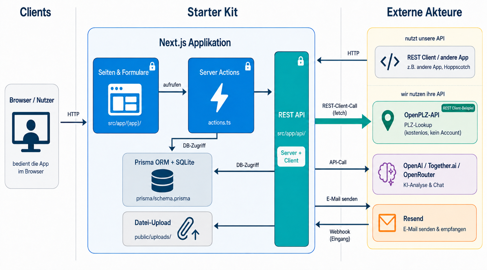
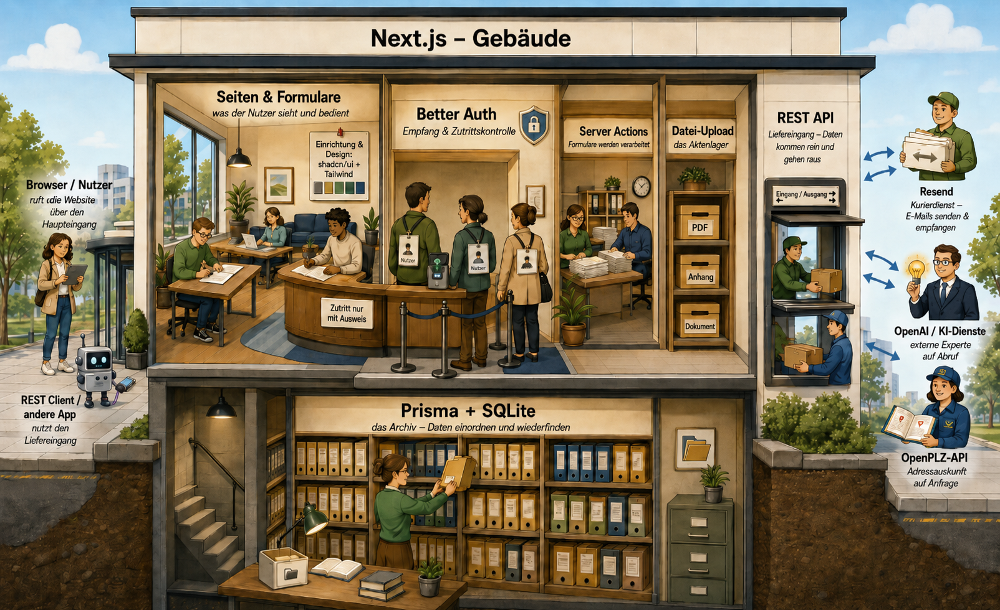

# Tech Stack Übersicht – Die Bausteine des Starter Kits

Dieses Dokument gibt eine Orientierungshilfe: Welche Bausteine hat das Starter Kit, wofür ist jeder zuständig, und wo findest du ihn im Repository wieder?

Es richtet sich an Studierende ohne primären Software-Hintergrund. Keine Vorkenntnisse in Web-Entwicklung nötig – du brauchst dieses Wissen, um einzuschätzen, **wann du wo nachschauen musst**.

---

## Architekturübersicht


*Erstellt mit OpenAI gpt-image-2, Thinking Mode (ChatGPT GPT-5.5)*

---

## Die gleichen Bausteine als Gebäude-Metapher


*Erstellt mit OpenAI gpt-image-2, Thinking Mode (ChatGPT GPT-5.5)*

---

## Die acht Bausteine auf einen Blick

| Baustein | Zuständigkeit | Wo im Repo | Guide |
|---|---|---|---|
| **Next.js** *(das Gebäude)* | Grundgerüst – enthält Seiten & Formulare sowie Server Actions | `src/app/` | — |
| **shadcn/ui + Tailwind** *(die Inneneinrichtung)* | Aussehen aller Seiten – Buttons, Layouts, Farben | `src/components/ui/` | — |
| **Prisma + SQLite** *(das Archiv)* | Daten speichern und lesen | `prisma/schema.prisma` | [Schema Reset](SCHEMA_RESET_WORKFLOW.md) |
| **Better Auth** *(der Empfang)* | Login, Rollen, Zugangskontrolle | `src/lib/auth.ts` | [Getting Started](GETTING_STARTED.md) |
| **REST API** *(der Liefereingang)* | Schnittstellen nach aussen – Server & Client | `src/app/api/` | [REST API Guide](REST_API_GUIDE.md) |
| **Datei-Upload** *(das Aktenlager)* | PDFs hochladen, anzeigen, herunterladen | `public/uploads/` | [File Upload Guide](FILE_UPLOAD_GUIDE.md) |
| **LLM-Integration** *(der externe Übersetzer)* | KI-Analyse und Chat | `src/lib/ai.ts` | [LLM Integration](LLM_INTEGRATION.md) |
| **E-Mail via Resend** *(der Kurierdienst)* | E-Mails senden und empfangen | `src/lib/emails/` | [E-Mail Integration](EMAIL_INTEGRATION.md) |

---

## Baustein 1 – Next.js (das Gebäude)

**Was es tut:** Next.js ist das Grundgerüst der gesamten Applikation. Es liefert die Webseiten an den Browser aus, verarbeitet Formulareingaben und enthält die Geschäftslogik.

**Einfaches Bild:** Das Gebäude selbst – alle anderen Bausteine sind Räume oder Installationen darin.

Innerhalb von Next.js gibt es zwei Bereiche, die in beiden Bildern sichtbar sind:

**Seiten & Formulare** *(der Publikumsbereich)*: React-Komponenten und Seiten – das, was der Nutzer im Browser sieht und bedient. Formulare, Tabellen, Buttons.
- [src/app/(app)/](../../src/app/(app)/) – alle Seiten nach dem Login (z.B. Anträge, Personen)
- [src/app/login/](../../src/app/login/) – Loginseite

**Server Actions** *(das Backoffice)*: Funktionen, die direkt aus Formularen aufgerufen werden und serverseitig laufen – ohne Umweg über einen API-Endpunkt. Sie lesen und schreiben die Datenbank via Prisma.
- [src/app/(app)/antraege/actions.ts](../../src/app/(app)/antraege/actions.ts) – Beispiel: Antrag erstellen, Status ändern
- [src/app/(app)/personen/actions.ts](../../src/app/(app)/personen/actions.ts) – Beispiel: Person anlegen, bearbeiten

**Wann schaust du hier nach:** Wenn du eine neue Seite hinzufügen, eine bestehende anpassen oder die Verarbeitungslogik hinter einem Formular verstehen oder ändern möchtest.

---

## Baustein 2 – shadcn/ui + Tailwind CSS (das Aussehen)

**Was es tut:** Diese Bibliotheken bestimmen, wie die App aussieht: Buttons, Formulare, Tabellen, Navigationsleisten. Sie stellen fertige, wiederverwendbare UI-Komponenten bereit.

**Einfaches Bild:** Die Inneneinrichtung des Gebäudes – Möbel, Farben, Layouts.

**Wo im Repository:**
- [src/components/ui/](../../src/components/ui/) – fertige Bausteine wie Button, Card, Input, Table
- [src/components/](../../src/components/) – projektspezifische Komponenten wie Sidebar, Formulare

**Wann schaust du hier nach:** Wenn du ein Formular, eine Tabelle oder ein UI-Element anpassen möchtest.

---

## Baustein 3 – Prisma + Datenbank (die Datenspeicherung)

**Was es tut:** Prisma ist der Übersetzer zwischen der App und der Datenbank. Das Schema beschreibt, welche Daten gespeichert werden (z.B. Anträge, Personen, Nutzer). Die Datenbank selbst ist lokal SQLite (eine einzelne Datei) oder in der Cloud Neon (PostgreSQL).

**Einfaches Bild:** Das Archiv des Gebäudes – Prisma ist der Archivar, der Daten einordnet und wiederfindet.

**Wo im Repository:**
- [prisma/schema.prisma](../../prisma/schema.prisma) – die Datenstruktur (Tabellen, Felder, Beziehungen)
- [prisma/seed.ts](../../prisma/seed.ts) – Testdaten (Demo-Nutzer, Beispieleinträge)
- `prisma/dev.db` – die lokale Datenbankdatei (nicht in Git, entsteht beim Setup)

**Wichtige Befehle:**
```bash
npm run db:push    # Schema in die Datenbank übernehmen
npm run db:seed    # Testdaten einspielen
npm run db:reset   # Alles zurücksetzen + Testdaten neu laden
npm run db:studio  # Datenbankinhalt visuell im Browser ansehen
```

**Wann schaust du hier nach:** Wenn du Datenfelder ändern, neue Entitäten anlegen oder Testdaten anpassen möchtest.

**Vertiefung:** [Schema Reset Workflow](SCHEMA_RESET_WORKFLOW.md) · Hintergrund: [Tech-Stack-Entscheide](../starter-kit-erstellung/impl-00-tech-stack-decisions.md) (Abschnitt 1–2)

---

## Baustein 4 – Better Auth (Anmeldung und Rollen)

**Was es tut:** Better Auth verwaltet, wer sich anmelden kann und welche Rechte eine Person hat. Die Rollen (`antragsteller`, `reviewer`) steuern, welche Seiten und Aktionen jemand sehen und ausführen darf.

**Einfaches Bild:** Der Empfang mit Zutrittskontrolle – nur wer eine gültige Karte hat, kommt ins entsprechende Stockwerk.

**Wo im Repository:**
- [src/lib/auth.ts](../../src/lib/auth.ts) – Auth-Konfiguration (Rollen, Session-Logik)
- [src/lib/auth-client.ts](../../src/lib/auth-client.ts) – Auth-Hilfsfunktionen für Client-Komponenten
- [prisma/seed.ts](../../prisma/seed.ts) – Demo-Nutzer mit Rollen werden hier angelegt

**Demo-Zugangsdaten (nach `npm run db:seed`):**

| Rolle | E-Mail | Passwort |
|---|---|---|
| Antragsteller | `demo@example.com` | `demo1234` |
| Reviewer | `review@example.com` | `review1234` |

**Wann schaust du hier nach:** Wenn du Rollen anpassen, neue Demo-Nutzer anlegen oder rollenbasierte Sichten verstehen möchtest.

**Vertiefung:** [Getting Started](GETTING_STARTED.md) · Hintergrund: [Tech-Stack-Entscheide](../starter-kit-erstellung/impl-00-tech-stack-decisions.md) (Abschnitt 4)

---

## Baustein 5 – REST API (Schnittstellen nach aussen)

**Was es tut:** Die REST API macht Daten der App über standardisierte HTTP-Endpunkte abrufbar – z.B. für externe Tools, andere Services oder automatisierte Abfragen. Das Starter Kit zeigt beide Rollen:

- **REST-Server:** Die App *bietet* eine API an (Anträge, Personen, KI, Upload).
- **REST-Client:** Die App *ruft* selbst eine externe API auf – demonstriert am PLZ-Lookup-Feature: Das Formular für neue Anträge enthält eine PLZ/Ort-Autocomplete, die intern den eigenen Proxy-Endpunkt `/api/plz-lookup` aufruft. Dieser wiederum ruft die öffentliche [OpenPLZ-API](https://openplzapi.org) auf, gibt die Ergebnisse zurück und kapselt dabei CORS-Probleme und Fehlerbehandlung serverseitig.

**Einfaches Bild:** Der Liefereingang des Gebäudes – externe Systeme können Daten abholen oder abliefern, ohne die Haustür zu benutzen. Und der Lieferdienst kann seinerseits bei anderen Lagern einkaufen.

**Wo im Repository:**
- [src/app/api/antraege/](../../src/app/api/antraege/) – Endpunkte für Anträge (GET, POST, PUT, DELETE)
- [src/app/api/auth/](../../src/app/api/auth/) – Auth-Endpunkte (automatisch von Better Auth)
- [src/app/api/upload/](../../src/app/api/upload/) – Datei-Upload-Endpunkt
- [src/app/api/ai/](../../src/app/api/ai/) – KI-Endpunkte (Chat, Dokumentenanalyse)
- [src/app/api/plz-lookup/](../../src/app/api/plz-lookup/) – PLZ-Lookup-Proxy (REST-Client-Beispiel)

**Wann schaust du hier nach:** Wenn du verstehen möchtest, welche Daten die App nach aussen bereitstellt, einen neuen API-Endpunkt brauchst, oder wissen möchtest, wie die App selbst externe APIs aufruft.

**Vertiefung:** [REST API Guide](REST_API_GUIDE.md) · [REST-Client Guide (PLZ-Lookup)](REST_CLIENT_GUIDE.md)

---

## Baustein 6 – Datei-Upload (Dateispeicherung)

**Was es tut:** Nutzerinnen können Dateien (PDFs, Bilder) hochladen, die dann in der App angezeigt oder heruntergeladen werden können. Lokal landen Dateien im Ordner `public/uploads/`, für Cloud-Deployments wird UploadThing eingesetzt.

**Einfaches Bild:** Das Aktenlager – Dokumente kommen rein, werden abgelegt und können jederzeit wieder herausgeholt werden.

**Wo im Repository:**
- [src/app/api/upload/route.ts](../../src/app/api/upload/route.ts) – Upload-Logik (Server)
- [src/components/antraege/antrag-upload.tsx](../../src/components/antraege/antrag-upload.tsx) – Upload-Komponente (UI)
- [src/components/pdf-viewer.tsx](../../src/components/pdf-viewer.tsx) – PDF-Anzeige
- `public/uploads/` – Speicherort der hochgeladenen Dateien (lokal)

**Wann schaust du hier nach:** Wenn du den Upload-Prozess anpassen oder Dateifelder zu neuen Entitäten hinzufügen möchtest.

**Vertiefung:** [File Upload Guide](FILE_UPLOAD_GUIDE.md) · Hintergrund: [Tech-Stack-Entscheide](../starter-kit-erstellung/impl-00-tech-stack-decisions.md) (Abschnitt 5)

---

## Baustein 7 – LLM-Integration (der externe Übersetzer)

**Was es tut:** KI-gestützte Chat-Funktionen und automatische Dokumentenanalyse. Die App verbindet sich mit einem Sprachmodell-Anbieter (OpenAI, Together.ai oder OpenRouter) und kann so Dokumente analysieren oder Konversationen führen.

**Einfaches Bild:** Ein externer Übersetzer oder Experte, der auf Abruf hinzugezogen wird – er arbeitet nicht im Gebäude, wird aber bei Bedarf beauftragt.

**Wo im Repository:**
- [src/lib/ai.ts](../../src/lib/ai.ts) – LLM-Logik (Modell-Konfiguration, Hilfsfunktionen)
- [src/lib/services/plzService.ts](../../src/lib/services/plzService.ts) – Beispiel eines externen Service-Calls (REST-Client-Muster)
- [src/app/api/ai/](../../src/app/api/ai/) – API-Endpunkte für Chat und Dokumentenanalyse

**Wann schaust du hier nach:** Wenn du KI-Funktionen aktivieren oder anpassen möchtest.

**Vertiefung:** [LLM Integration](LLM_INTEGRATION.md)

---

## Baustein 8 – E-Mail via Resend (der Kurierdienst)

**Was es tut:** Die App versendet automatisch E-Mails (z.B. Eingangsbestätigungen) und kann E-Mails empfangen. Ein Reviewer kann per E-Mail auf einen Antrag antworten – die E-Mail wird als Notiz am Antrag gespeichert.

**Einfaches Bild:** Ein Kurierdienst mit Rückgabekanal – Briefe gehen raus (Outbound) und kommen auch wieder rein (Inbound via Webhook).

**Wo im Repository:**
- [src/lib/emails/templates.ts](../../src/lib/emails/templates.ts) – E-Mail-Vorlagen
- [src/lib/services/emailService.ts](../../src/lib/services/emailService.ts) – E-Mail-Versand-Logik (Outbound)
- [src/lib/services/antragEmailService.ts](../../src/lib/services/antragEmailService.ts) – Verarbeitung eingehender E-Mails (Inbound)
- [src/app/api/webhooks/resend/route.ts](../../src/app/api/webhooks/resend/route.ts) – Webhook-Empfänger für eingehende E-Mails

**Wann schaust du hier nach:** Wenn du E-Mail-Benachrichtigungen einrichten oder verstehen möchtest, wie eingehende E-Mails verarbeitet werden.

**Vertiefung:** [E-Mail Integration](EMAIL_INTEGRATION.md)

---

## Der KI-Coding-Assistent (.agents/skills/)

Das Starter Kit enthält vorgefertigte Agent-Skills unter [.agents/skills/](../../.agents/skills/). Diese Skills sind Anweisungen für den KI-Coding-Assistenten (Kilo Code), wie er wiederkehrende Aufgaben im Projekt ausführen soll – z.B. Schema ändern, PIV-Workflow durchführen oder Dokumentation aktualisieren.

Das ist kein Baustein der App selbst, sondern **Werkzeug für die Entwicklung**. Mehr dazu im [PIV-Workflow Guide](PIV-WORKFLOW.md).

---

## Lokal vs. Cloud: zwei Betriebsvarianten

Das Starter Kit hat zwei Betriebsmodi, die du je nach Bedarf wählst:

| | Lokal (Standard) | Cloud (optional) |
|---|---|---|
| **Datenbank** | SQLite (`prisma/dev.db`) | Neon (PostgreSQL) |
| **Dateispeicher** | `public/uploads/` | UploadThing |
| **Deployment** | Lokaler Dev-Server | Vercel |
| **Demo-Präsentation** | VS Code Port Forwarding | öffentliche URL |
| **Setup-Aufwand** | Minimal (keine Accounts) | Mittel (Cloud-Accounts nötig) |

**Für den Kursalltag:** Die lokale Variante reicht vollständig aus. Für öffentliche Demos nutzt du [VS Code Port Forwarding](VSCODE_PORT_FORWARDING.md).

---

## Wo schaue ich wann nach?

| Situation | Richtiger Ort |
|---|---|
| App starten und Setup verstehen | [README.md](../../README.md) → [Getting Started](GETTING_STARTED.md) |
| Neues Datenfeld oder Entität | `prisma/schema.prisma` → [Schema Reset](SCHEMA_RESET_WORKFLOW.md) |
| Neue Seite oder Formular | `src/app/(app)/` und `src/components/` |
| Formular-Logik (Server Action) anpassen | `src/app/(app)/**/actions.ts` |
| API-Endpunkt verstehen oder erweitern | `src/app/api/` → [REST API Guide](REST_API_GUIDE.md) |
| Externe REST-API aufrufen (App als Client) | `src/app/api/plz-lookup/` → [REST-Client Guide](REST_CLIENT_GUIDE.md) |
| Datei-Upload anpassen | `src/app/api/upload/` → [File Upload Guide](FILE_UPLOAD_GUIDE.md) |
| KI-Funktion aktivieren | `src/lib/ai.ts` → [LLM Integration](LLM_INTEGRATION.md) |
| E-Mail-Versand einrichten | `src/lib/emails/` → [E-Mail Integration](EMAIL_INTEGRATION.md) |
| Demo auf zweitem Laptop zeigen | [VS Code Port Forwarding](VSCODE_PORT_FORWARDING.md) |
| Deployment auf Vercel | [Neon Setup](NEON_SETUP.md) → [Vercel Deployment](VERCEL_DEPLOYMENT.md) |
| Tests verstehen und ausführen | [Testing Guide](TESTING.md) |
| Gruppenarbeit koordinieren | [Collaboration Guide](COLLABORATION.md) |
| Warum wurde X so entschieden? | [Tech-Stack-Entscheide](../starter-kit-erstellung/impl-00-tech-stack-decisions.md) |
